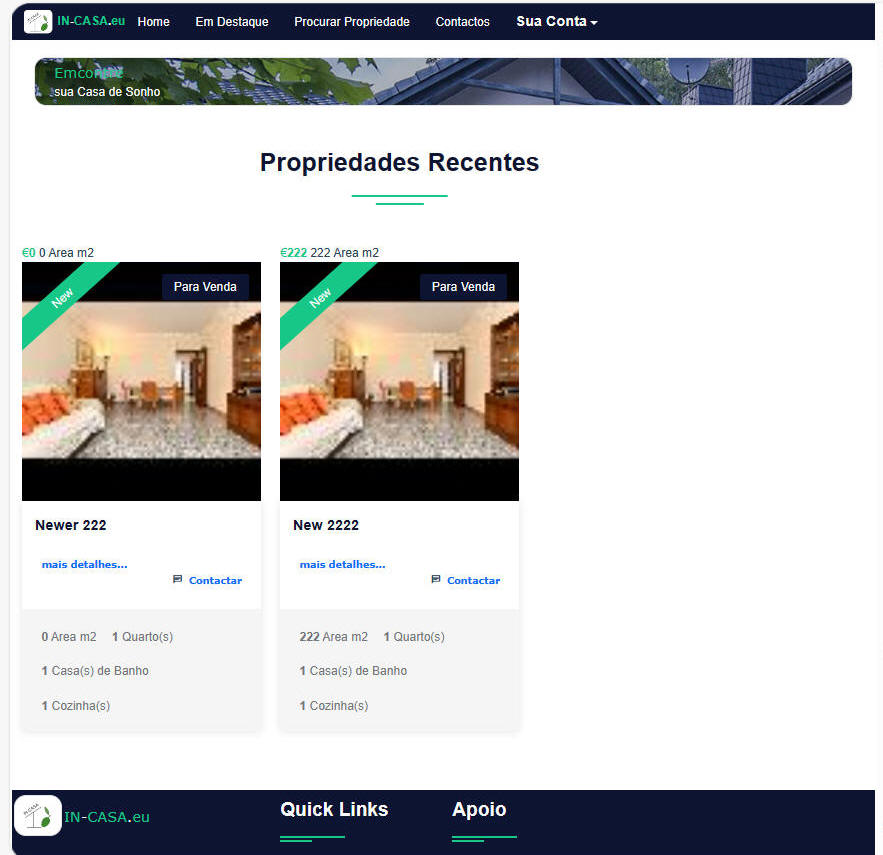
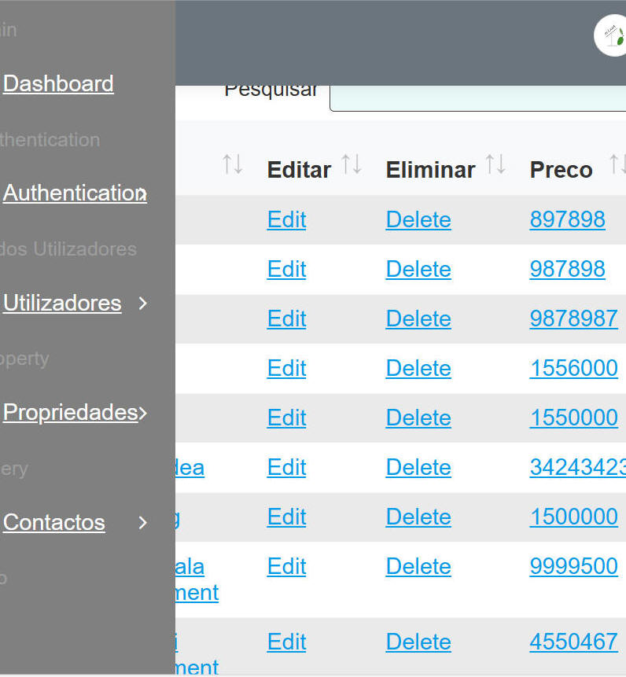

# incasa

this is a fork of:
https://github.com/suraj25809/Real-Estate-Php

Scripted for small to medium size real estate agencies.

changes made include:
- added Portuguese and Spanish language strings
- using later version of bootstrap and added primer
- modified property adding and editing

general script purging and cleanup on todo list.
......

screen-shots:

admin section:

suraj25809/Real-Estate-Php readme:
# Real-Estate-Php

Realestate Management system

This is a ready to use web application for managing Real Estate System. the application is built on PHP and Mysql, its interface is very user friendly.

Description

It can easily be used to manage two different group of users with different permission level.User can find Property easily in particular and Specific Location,Loan Calculator, Admin can Manage all data , User can Add property etc....

# Requirements

    PHP >= 5;
    PDO PHP Extension;
    GD PHP extension
    MySQL >= 5.7;

# Installation

    Modify config.php file

    $con = mysqli_connect("server_name","user_name","password","Database_name");

Import the Database in Your Server like Xampp, Wamp

Database Name -: developer

